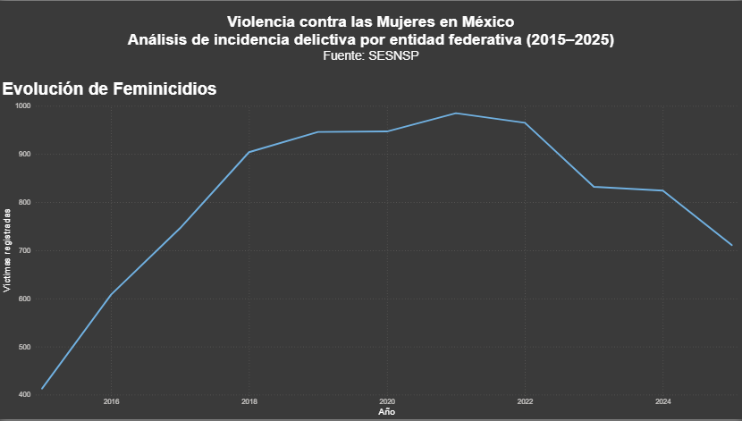
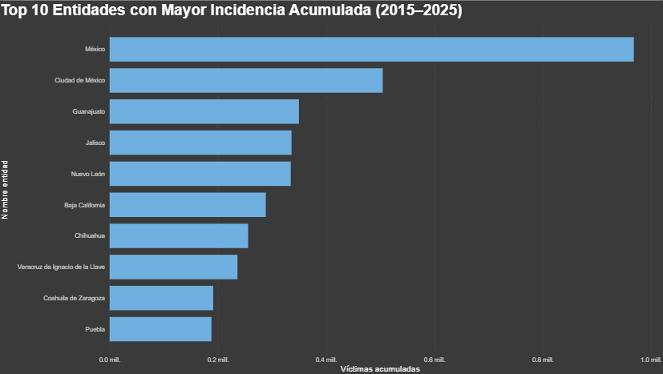
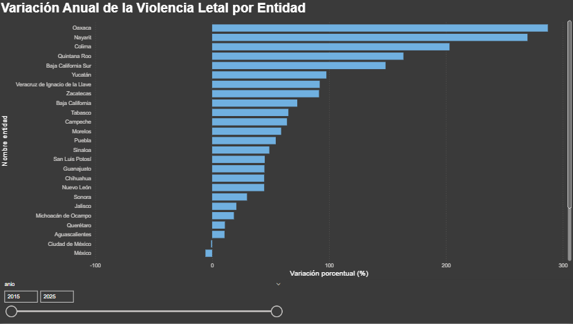
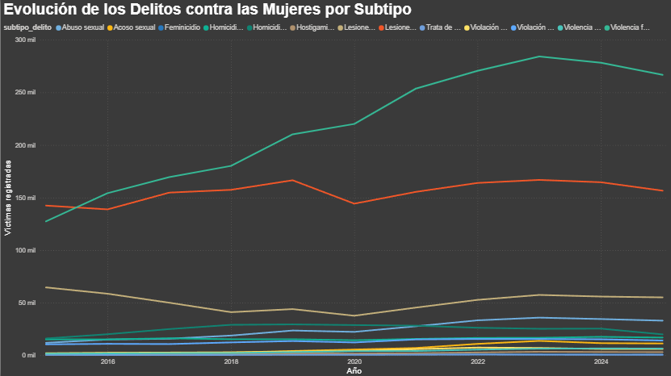

# Análisis de incidencia delictiva contra las mujeres por entidad federativa en México (2015–2025)


> Proyecto Final · Módulo 4: Inteligencia de negocios y SQL avanzado  
> Diplomado Manejo de bases de datos sql Y nosql en un entorno de nube. — IIMAS, UNAM.
> **Alumna:** Karla Yoloxochitl Erazo Amaya

---

## Resumen ejecutivo

| Campo | Valor |
|---|---|
| **Pregunta analítica** | ¿Cómo ha evolucionado la incidencia de los principales delitos contra las mujeres en México entre 2015 y 2025, y qué entidades federativas presentan los mayores niveles y tendencias de crecimiento? |
| **Dataset** | Incidencia Delictiva Estatal (SESNSP) 2015–2025 |
| **Fuente** | [sesnsp.gob.mx — Datos abiertos de incidencia delictiva estatal](https://www.gob.mx/sesnsp/acciones-y-programas/datos-abiertos-de-incidencia-delictiva) |
| **Modelo** | Estrella: 1 fact + 3 dimensiones (tiempo, entidad, delito) |
| **Infraestructura** | AWS Aurora PostgreSQL — schema `violencia_dwh` |
| **ETL** | Python (pandas + SQLAlchemy) |
| **SQL avanzado** | Window functions (`RANK`, `LAG`), CTEs, funciones analíticas (`PERCENTILE_CONT`) |
| **Dashboard** | Power BI |

---

## Problema y motivación

La violencia contra las mujeres es uno de los principales problemas de seguridad y derechos humanos en México. En los últimos años, ha aumentado la cantidad de delitos como el feminicidio, el homicidio doloso, las lesiones dolosas y la violencia familiar.

Las autoridades publican información sobre la incidencia delictiva de forma regular. Sin embargo, el gran volumen de datos dificulta la identificación de patrones territoriales y temporales.

Este proyecto busca responder cuatro preguntas analíticas:

1. ¿Qué entidades federativas concentran el mayor número de delitos contra las mujeres?
2. ¿Cómo ha evolucionado la incidencia de estos delitos entre 2015 y 2025?
3. ¿Hay estados donde el crecimiento de la violencia ha sido significativamente mayor que el promedio nacional?
4. ¿Cuáles son los delitos que presentan las tendencias de crecimiento más preocupantes?

La respuesta a estas preguntas permite identificar focos de atención para el diseño de políticas públicas y estrategias de prevención.

---

## Origen de los datos

**Fuente:** Secretariado Ejecutivo del Sistema Nacional de Seguridad Pública (SESNSP)  
**Descarga directa:** https://www.gob.mx/sesnsp/acciones-y-programas/datos-abiertos-de-incidencia-delictiva  
**Archivo:** `Estatal-Delitos-2015-2025_abr2026.csv`

El dataset contiene más de 8,800 víctimas registradas por feminicidio durante el periodo analizado, además de otros delitos contra las mujeres para las 32 entidades federativas, generando decenas de miles de observaciones para análisis temporal y geográfico.

### Estructura del archivo fuente

El archivo original contiene **todos los delitos del fuero común** con la siguiente estructura:

| Columna | Descripción |
|---|---|
| `Año` | Año del registro (2015–2025) |
| `Clave_Ent` | Clave INEGI de la entidad federativa (1–32) |
| `Entidad` | Nombre de la entidad federativa |
| `Bien jurídico afectado` | Categoría jurídica (ej. "La vida y la integridad corporal") |
| `Tipo de delito` | Delito específico (ej. "Feminicidio", "Homicidio", "Lesiones") |
| `Subtipo de delito` | Desglose del tipo (ej. "Homicidio doloso", "Homicidio culposo") |
| `Modalidad` | Medio o circunstancia (ej. "Con arma de fuego", "Con arma blanca") |
| `Enero` … `Diciembre` | Número de víctimas registradas por mes |

El ETL filtra únicamente los subtipos relevantes para el análisis de violencia contra las mujeres.

### Delitos seleccionados para el análisis

| Tipo de delito | Subtipo | Categoría analítica |
|---|---|---|
| Feminicidio | Feminicidio | Violencia letal intencional |
| Homicidio | Homicidio doloso | Violencia letal intencional |
| Homicidio | Homicidio culposo | Violencia letal no intencional |
| Lesiones | Lesiones dolosas | Violencia no letal |
| Lesiones | Lesiones culposas | Violencia no letal |
| Trata de personas | Trata de personas | Violencia no letal |
| Violencia familiar | Violencia familiar | Violencia no letal |
| Violencia de género | Violencia de género en todas sus modalidades | Violencia no letal |
| Acoso sexual | Acoso sexual | Violencia no letal |
| Hostigamiento sexual | Hostigamiento sexual | Violencia no letal |
| Abuso sexual | Abuso sexual | Violencia no letal |
| Violación | Violación simple | Violencia no letal |
| Violación | Violación equiparada | Violencia no letal |

13 subtipos en total, correspondientes a los 13 registros de `dim_delito` en Aurora.

### Flujo end-to-end

```
┌──────────────────────────────────────────────┐
│  SESNSP (portal público)                     │
│  gob.mx/sesnsp/datos-abiertos-incidencia     │
│                                              │
│  • CSV con todos los delitos                 │
│    del fuero común 2015–2025                 │
│  • Columnas: Año, Entidad, Bien jurídico,    │
│    Tipo, Subtipo, Modalidad, Ene–Dic         │
└──────────────────────┬───────────────────────┘
                       │  pandas read_csv
                       ▼
┌──────────────────────────────────────────────┐
│  ETL Python — etl_pipeline.py                │
│                                              │
│  Extract:   lee archivo fuente               │
│  Transform: filtra subtipos de interés,      │
│             conversión formato ancho→largo,  │
│             normalización de nombres,        │
│             construcción de dimensiones,     │
│             generación de surrogate keys     │
│  Load:      to_sql() con SQLAlchemy          │
│  Validate:  conteo vs origen                 │
└──────────────────────┬───────────────────────┘
                       │  INSERT
                       ▼
┌──────────────────────────────────────────────┐
│  AWS Aurora PostgreSQL                       │
│  Schema: violencia_dwh                       │
│                                              │
│  • 3 dimensiones pobladas                    │
│  • fact_victimas                             │
└──────────────────────┬───────────────────────┘
                       │  conexión directa
                       ▼
┌──────────────────────────────────────────────┐
│  Dashboard Power BI                          │
│  3+ visualizaciones interactivas             │
└──────────────────────────────────────────────┘
```

---

## Estructura del repositorio

```
proyecto-violencia-mujeres/
│
├── README.md
│
├── datasets/
│   └── Estatal-Delitos-2015-2025_abr2026.csv
│
├── scripts/
│   ├── 01_schema_ddl.sql
│   ├── etl_pipeline.py
│   └── queries_analiticas.sql
│
├── dashboard/
│   ├── violencia_mujeres.pbix
│   └── data/
│       ├── evolucion_feminicidios.csv
│       ├── top10_entidades.csv
│       ├── mapa_entidades.csv
│       ├── variacion_anual.csv
│       └── crecimiento_delitos.csv
│
└── docs/
    ├── diagrama_modelo.png
    ├── dashboard_pagina1.png
    ├── dashboard_pagina2.png
    ├── dashboard_pagina3.png
    └── dashboard_pagina4.png
```

---

## Modelo dimensional

### Grano de la tabla de hechos

Cada registro de `fact_victimas` representa el número de víctimas registradas para un subtipo de delito específico en una entidad federativa durante un mes determinado.

### Esquema estrella

```
                    ┌──────────────────┐
                    │   dim_tiempo     │
                    │                  │
                    │ id_tiempo PK     │
                    │ anio             │
                    │ mes              │
                    │ nombre_mes       │
                    │ trimestre        │
                    │ semestre         │
                    │ periodo_label    │
                    │ es_anio_pandemia │
                    └────────┬─────────┘
                             │
┌──────────────────┐  ┌──────┴───────────────────────┐  ┌──────────────────┐
│   dim_entidad    │◄─│       fact_victimas          │─►│   dim_delito     │
│                  │  │                              │  │                  │
│ id_entidad PK    │  │ id_hecho PK                  │  │ id_delito PK     │
│ clave_entidad    │  │ id_tiempo FK                 │  │ tipo_delito      │
│ nombre_entidad   │  │ id_entidad FK                │  │ subtipo_delito   │
│ region           │  │ id_delito FK                 │  │ bien_juridico    │
└──────────────────┘  │                              │  │ categoria        │
                      │ num_victimas                 │  │ es_letal         │
                      │ fuente                       │  └──────────────────┘
                      │ fecha_carga                  │
                      └──────────────────────────────┘
```

### Decisiones de diseño

**Grano de la fact:** una fila por (entidad × subtipo de delito × mes). Cada fila es un agregado mensual, no una víctima individual. El campo `id_hecho` es la llave surrogate del hecho.

**`subtipo_delito` y `bien_juridico` en dim_delito:** el archivo fuente tiene tres niveles (tipo → subtipo → modalidad). Se consolidan tipo y subtipo en la dimensión para tener el grano correcto de análisis. La modalidad (arma de fuego, arma blanca, etc.) se omite en esta versión para mantener el modelo simple y enfocado.

**`region` en dim_entidad:** agrupa los 32 estados en regiones geográficas (Norte, Centro, Sur, CDMX) para análisis de clusters sin joins adicionales — desnormalización deliberada siguiendo la metodología Kimball.

**`es_letal` en dim_delito:** flag que separa delitos letales (feminicidio, homicidio) de no letales (lesiones, trata, violencia familiar) con un filtro simple.

**`es_anio_pandemia` en dim_tiempo:** controla el efecto COVID-19 en 2020–2021, donde el confinamiento alteró tanto la incidencia real como el registro de denuncias.

---

## Cómo ejecutar

### Requisitos previos

```bash
pip install pandas sqlalchemy psycopg2-binary
```

### 1. Descargar el dataset

1. Ir a: https://www.gob.mx/sesnsp/acciones-y-programas/datos-abiertos-de-incidencia-delictiva
2. Descargar: **"Estatal-Delitos-2015-2025"**
3. Guardar en: `datasets/Estatal-Delitos-2015-2025_abr2026.csv`

### 2. Crear el schema en Aurora

```bash
psql "postgresql://postgres:TU_PASSWORD@TU_HOST.rds.amazonaws.com:5432/northwind" \
     -f scripts/01_schema_ddl.sql
```

### 3. Correr el ETL

```bash
export AURORA_HOST=TU_HOST.rds.amazonaws.com
export AURORA_PASSWORD=TU_PASSWORD

python scripts/etl_pipeline.py
```

### 4. Abrir el dashboard

Abrir `dashboard/violencia_mujeres.pbix` en Power BI Desktop.

---

## Estado actual de implementación

El modelo dimensional fue creado en AWS Aurora PostgreSQL dentro del schema `violencia_dwh`.

El ETL en Python se ejecutó correctamente contra Aurora y cargó:

Dataset origen: 34,496 registros  
Fact table final: 54,912 registros (tras la transformación ancho → largo y el filtrado de subtipos relevantes)

| Tabla | Registros |
|---|---:|
| dim_tiempo | 132 |
| dim_entidad | 32 |
| dim_delito | 13 |
| fact_victimas | 54,912 |

Validaciones post-carga:

- Llaves foráneas huérfanas: 0
- Suma total de víctimas en origen: 5,763,371
- Suma total de víctimas en Aurora: 5,763,371

Esto confirma que la carga fue completa y consistente.

---

## SQL avanzado — técnicas aplicadas

### 1. Window function — Ranking de entidades por feminicidios (`RANK`)
```sql
SELECT
    de.nombre_entidad,
    dt.anio,
    SUM(fv.num_victimas) AS total_feminicidios,
    RANK() OVER (
        PARTITION BY dt.anio
        ORDER BY SUM(fv.num_victimas) DESC
    ) AS ranking_anual
FROM violencia_dwh.fact_victimas fv
JOIN violencia_dwh.dim_tiempo  dt USING (id_tiempo)
JOIN violencia_dwh.dim_entidad de USING (id_entidad)
JOIN violencia_dwh.dim_delito  dd USING (id_delito)
WHERE dd.subtipo_delito = 'Feminicidio'
GROUP BY de.nombre_entidad, dt.anio;
```

### 2. Window function — Variación año a año (`LAG`)
```sql
WITH anual AS (
    SELECT
        de.nombre_entidad,
        dt.anio,
        SUM(fv.num_victimas) AS total
    FROM violencia_dwh.fact_victimas fv
    JOIN violencia_dwh.dim_tiempo  dt USING (id_tiempo)
    JOIN violencia_dwh.dim_entidad de USING (id_entidad)
    JOIN violencia_dwh.dim_delito  dd USING (id_delito)
    WHERE dd.es_letal = TRUE
    GROUP BY de.nombre_entidad, dt.anio
)
SELECT
    nombre_entidad,
    anio,
    total,
    LAG(total) OVER (PARTITION BY nombre_entidad ORDER BY anio) AS anio_anterior,
    ROUND(100.0 * (total - LAG(total) OVER (
        PARTITION BY nombre_entidad ORDER BY anio)
    ) / NULLIF(LAG(total) OVER (
        PARTITION BY nombre_entidad ORDER BY anio), 0), 1) AS pct_cambio
FROM anual
ORDER BY pct_cambio DESC NULLS LAST;
```

### 3. CTE — Estados con mayor proporción de delitos letales
```sql
WITH totales AS (
    SELECT
        de.nombre_entidad,
        SUM(fv.num_victimas)                                   AS total_delitos,
        SUM(fv.num_victimas) FILTER (WHERE dd.es_letal = TRUE) AS delitos_letales
    FROM violencia_dwh.fact_victimas fv
    JOIN violencia_dwh.dim_entidad de USING (id_entidad)
    JOIN violencia_dwh.dim_delito  dd USING (id_delito)
    GROUP BY de.nombre_entidad
)
SELECT
    nombre_entidad,
    total_delitos,
    delitos_letales,
    ROUND(100.0 * delitos_letales / NULLIF(total_delitos, 0), 1) AS pct_letal
FROM totales
ORDER BY pct_letal DESC;
```

### 4. Función analítica — Percentil 90 por subtipo de delito (`PERCENTILE_CONT`)
```sql
SELECT
    dd.subtipo_delito,
    PERCENTILE_CONT(0.50) WITHIN GROUP (ORDER BY fv.num_victimas) AS mediana_mensual,
    PERCENTILE_CONT(0.90) WITHIN GROUP (ORDER BY fv.num_victimas) AS p90_mensual
FROM violencia_dwh.fact_victimas fv
JOIN violencia_dwh.dim_delito dd USING (id_delito)
GROUP BY dd.subtipo_delito
ORDER BY p90_mensual DESC;
```

---

## Dashboard en Power BI

El dashboard fue desarrollado en Power BI Desktop utilizando los resultados exportados desde las consultas analíticas ejecutadas en Aurora PostgreSQL.

Incluye cuatro páginas con visualizaciones interactivas y filtros temporales:

### Página 1 — Evolución de Feminicidios



Visualización de la evolución temporal de los feminicidios en México entre 2015 y 2025.

---

### Página 2 — Top 10 Entidades con Mayor Incidencia Acumulada



Ranking de las entidades federativas con el mayor número acumulado de víctimas registradas durante el periodo analizado.

---

### Página 3 — Variación Anual de la Violencia Letal



Análisis de la variación porcentual anual de los delitos letales por entidad federativa, permitiendo identificar estados con crecimientos o reducciones significativas.

---

### Página 4 — Evolución por Subtipo de Delito



Comparación temporal de los principales delitos contra las mujeres, incluyendo feminicidio, violencia familiar, lesiones y delitos sexuales.

Además, el dashboard incorpora filtros interactivos (slicers) para facilitar la exploración de los datos por periodo temporal.

Estas visualizaciones permiten analizar tendencias, identificar entidades prioritarias y detectar patrones de crecimiento en distintos tipos de violencia contra las mujeres.


---

## Hallazgos principales

El análisis de la incidencia delictiva contra las mujeres en México entre 2015 y 2025 permitió identificar patrones temporales y geográficos relevantes.

- Los feminicidios presentaron una tendencia creciente entre 2015 y 2021, alcanzando sus niveles más altos durante ese periodo. A partir de 2022 se observa una disminución moderada en los registros.
- El Estado de México, Ciudad de México, Guanajuato, Jalisco y Baja California concentran la mayor incidencia acumulada de delitos contra las mujeres durante el periodo analizado.
- Existen diferencias significativas entre entidades federativas respecto al crecimiento de la violencia letal. Algunas entidades muestran incrementos porcentuales muy superiores al promedio nacional, mientras que otras presentan reducciones durante los años recientes.
- La violencia familiar y las lesiones dolosas representan el mayor volumen de víctimas dentro de los delitos analizados, superando ampliamente a delitos letales como el feminicidio.
- El uso de funciones analíticas como `RANK()`, `LAG()` y `PERCENTILE_CONT()` permitió identificar entidades con incrementos atípicos y delitos con comportamientos significativamente distintos al promedio nacional.

Los resultados muestran que la violencia contra las mujeres presenta una distribución heterogénea entre entidades federativas y que existen tendencias diferenciadas según el tipo de delito, lo que refuerza la necesidad de políticas públicas focalizadas y estrategias de prevención específicas por región.

---

## Referencias

- [SESNSP — Datos abiertos de incidencia delictiva](https://www.gob.mx/sesnsp/acciones-y-programas/datos-abiertos-de-incidencia-delictiva)
- [SESNSP — Informe de violencia contra las mujeres](https://www.gob.mx/sesnsp/documentos/informe-de-violencia-contra-las-mujeres)
- Material del módulo 4 — IIMAS, UNAM: OLAP, ETL Python, SQL avanzado
- Kimball, R. & Ross, M. — *The Data Warehouse Toolkit*, 3ª ed.